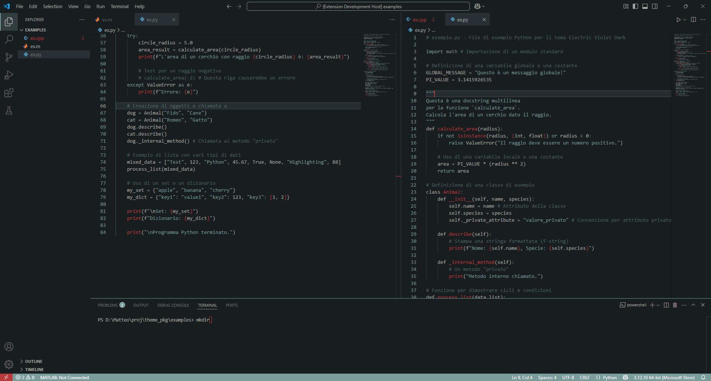

# The Red Dress Theme 

A minimalist dark theme for Visual Studio Code, using a color palette from the famous red dress scene from The Matrix.   
This theme focuses on simple design, allowing to focus on what matters during coding, and readability. 

Here are some scrrenshots and main colors used from the palette 

## Screenshots

## Color Palette  

| Color Name            | Hex Code  | Description / Primary Usage                                                                                                                              |
| :-------------------- | :-------- | :------------------------------------------------------------------------------------------------------------------------------------------------------- |
| **Eerie Black** | `#181D20` | The dominant background color for the editor, sidebars, terminal, input areas, notifications, and most main UI elements. |
| **Ash Grey** | `#A7AAA0` | The primary color for text, icons, general variables, operators, punctuation, and many UI elements (e.g., titles, general foreground). |
| **Cambridge Blue** | `#7A9C9B` | The dominant accent color for focus borders, active selections, buttons, progress indicators, and notably for **keywords**, **strings**, **inserted markup**, and various interactive UI elements. |
| **Persian Red** | `#B83A3A` | The "red dress" accent of the theme. Used for errors, invalid elements, numbers, language constants, and for **class declarations** and **function calls/definitions**. |
| **Hooker's Green** | `#6A8C8A` | Specifically used for **comments** (with transparency) and for hover states of some buttons or sliders. |

**Warmily, xxBalestraroXx**
