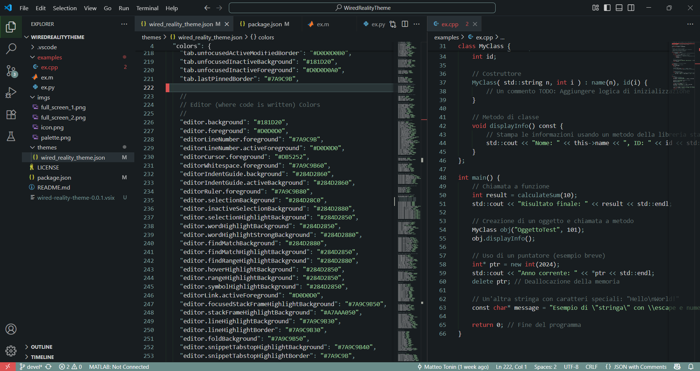
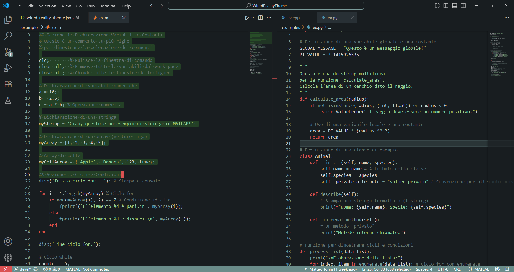
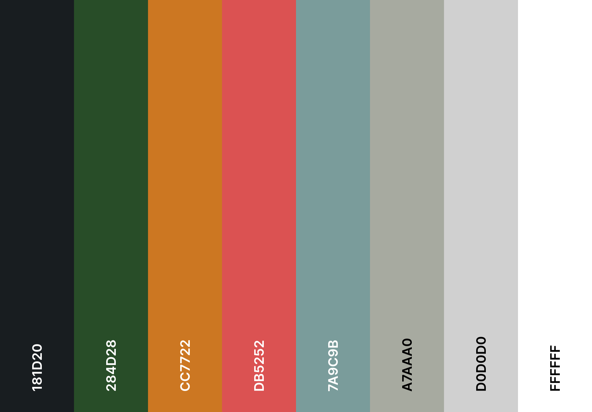

# Wired Reality

## Description

A dark VS Code theme designed to transport you back to the romantacized vision of the future aesthetic of the 1980s and 1990s.  

As it turned out technology aesthetic did not progress to become as imagined during that period, but we are still perfectly in time to indulge in that same fantasy. 

This theme is build using as referance gritty CRT monitors, long strings of bright green text ruinning through a dark terminal and bright red error messages on industrial gray bakgrounds. 

Readability and comfort is my top priority when it comes to themes for coding, so I tried to find a good balance between it being easy on the eyes but also captivating. 

I hope you find this theme to your liking, for any feedback fell free to cantact me.

*xXBalestraroXx*

## Screenshots

  

## Palette

## Color Palette  

